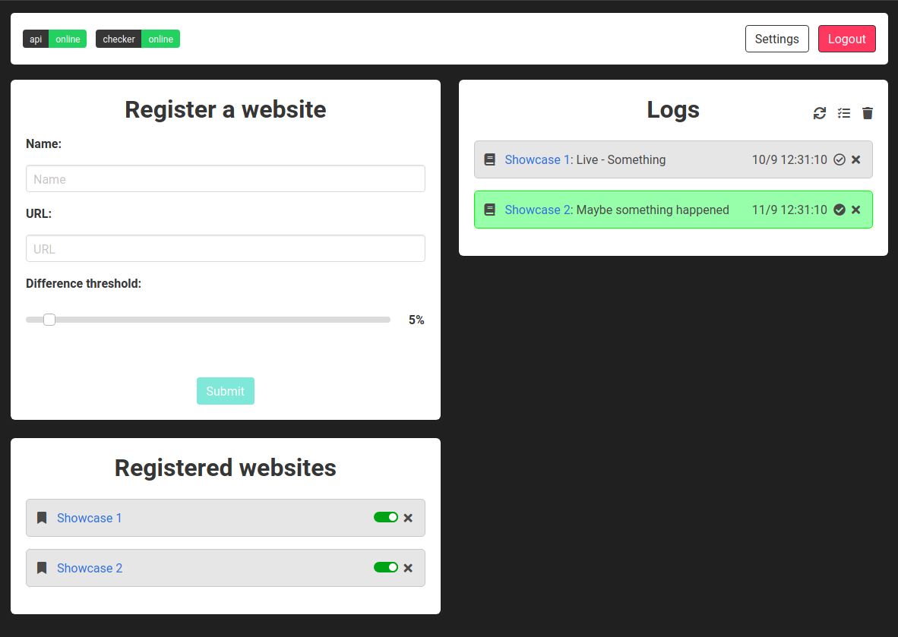

# Notify-Change
#### Logs websites changes
[](https://travis-ci.com/ivanch/notify-change)

## Deploy (Docker)
1. Configure the `docker-compose.yaml` file as you need it.
2. Simply run `docker-compose up -d`.

## Deploy (Build Docker Image)
* Run `docker-compose up -d --build` to build and deploy it afterwards.
* Run `docker-compose build` just to build.


## Usage
Default password is *password*, you can change or disable that later in Settings.

Once at the index page, you can start/stop the checker by clicking at its status.


## Reverse Proxy Example
1. Sample **nginx** configuration:
```
server {
    location /notify-change/ {
        proxy_pass http://localhost:8800/;
    }
}
```
2. At `package.json`, `"homepage"` should be defined as `./notify-change`

After that, you should be able to access it from [http://localhost/notify-change](http://localhost/notify-change). Note that you won't be able to access it using the 8000 port from your browser anymore.

>Reverse proxying a *react-router* app isn't so easy, you'll have to [build the Docker Image](#deploy-build-docker-image) again with your configuration.

## Screenshot



## Development
1. Go to `web` folder and run `npm install` to install dependencies and `npm start` to start the development server.
2. Go to `api` folder and run `pip install docker/requirements.txt` to install all the requirements.
3. Run `python app.py` to start the API server.

## Resource usage
| Service | State | RAM Usage |
|---------|-------|-----------|
| Web server | Idle/Active | About 2 MB |
| API server | Idle | About 20 MB |
| API server | Active | About 50 MB |

Note that at `docker-compose.yaml` the API is limited to use 50% of CPUs count and limite to 200MB RAM usage. It should work fine with lower configurations too.

## to-do:
* Add API key
* Add option to select a part of the website page
* Improve Settings modal
* Improve travis build script
* Write tests for Web service
* Write tests for API
* Handle high ping
* Handle no internet connection
* Handle errors on the checker thread
* Change to push notifications